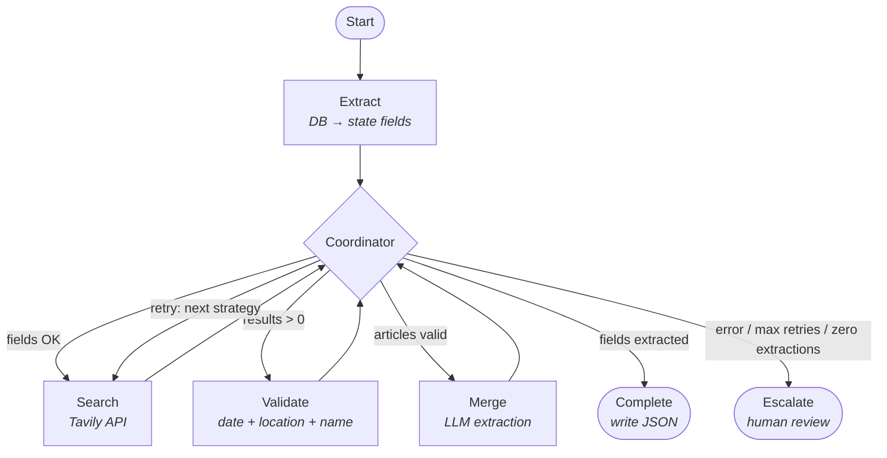

# Police Data Intelligence

**An agentic AI system for enriching missing data in police shooting databases**

[](https://opensource.org/licenses/MIT)
[](https://www.python.org/downloads/)
[](https://github.com/hongsupshin/police-data-intelligence/actions/workflows/ci.yml)

## Table of Contents

- [Overview](#overview)
- [Architecture](#architecture)
  - [Pipeline Nodes](#pipeline-nodes)
  - [Search Strategies](#search-strategies)
  - [Escalation Triggers](#escalation-triggers)
  - [Validation Logic](#validation-logic)
  - [Merge Logic](#merge-logic)
- [Quick Start](#quick-start)
  - [Prerequisites](#prerequisites)
  - [Setup](#setup)
  - [Run](#run)
  - [Example Output](#example-output)
  - [Evaluation](#evaluation)
  - [Configuration](#configuration)
- [Development](#development)
  - [Project Structure](#project-structure)
  - [Commands](#commands)
  - [Testing Patterns](#testing-patterns)
- [Performance](#performance)
  - [Cost](#cost)
- [Responsible AI](#responsible-ai)
- [Roadmap](#roadmap)
- [License](#license)
- [Acknowledgment](#acknowledgment)

## Overview

This project builds an agentic pipeline that **automatically enriches missing
data** in two Texas Justice Initiative (TJI) databases through intelligent web
search and extraction. The system's core purpose is data augmentation, not
analysis.

**Datasets**:

- **Civilians-Shot** (1,674 records): Police shooting civilians — 57% missing
  weapon info, 22.5% missing names
- **Officers-Shot** (282 records): Civilians shooting police — 40% missing
  officer names
- **Total**: 1,956 records needing enrichment

**The Problem**: TJI volunteers spend 15–30 minutes per record manually
searching news articles and extracting details.

**The Solution**: An agentic AI system that automates the enrichment workflow
while keeping humans in the loop, reducing volunteer time by 75%.

## Architecture

The system uses **7 nodes** orchestrated by a Coordinator in LangGraph:



Each node accepts and returns `EnrichmentState` (defined in
`src/agents/state.py`). The Coordinator reads `current_stage` to decide routing;
nodes update state fields, graph edges handle transitions.

### Pipeline Nodes

| Node            | Type          | Purpose                                                                    |
| --------------- | ------------- | -------------------------------------------------------------------------- |
| **Extract**     | Deterministic | Reads incident record from PostgreSQL, populates state fields              |
| **Search**      | Deterministic | Constructs query from incident fields, calls Tavily API for news articles  |
| **Validate**    | Rule-based    | Checks date proximity (±5 days), location match, and optional name match   |
| **Merge**       | LLM-powered   | Extracts structured fields from articles, checks cross-article consistency |
| **Coordinator** | Rule-based    | Gates after each stage — decides retry, proceed, or escalate               |
| **Complete**    | Terminal      | Writes enrichment results to JSON                                          |
| **Escalate**    | Terminal      | Writes escalation report to JSON for human review                          |

### Search Strategies

The Coordinator implements an escalating retry strategy:

| Retry | Strategy            | Description                                        |
| ----- | ------------------- | -------------------------------------------------- |
| 0     | `exact_match`       | All fields, exact date                             |
| 1     | `temporal_expanded` | Month + year format, keep both names               |
| 2     | `name_partial`      | Drop officer name, keep civilian name + month-year |
| 3     | `entity_dropped`    | Drop both names, keep location + date range        |
| 4     | Escalate            | Flag for human review                              |

### Escalation Triggers

The Coordinator routes to human review when:

- Max retries reached without sufficient validated articles
- No articles pass validation after all strategies
- Merge detects conflicts **and** zero agreed fields — if some fields agree
  while others conflict, the pipeline completes with the agreed fields and flags
  `requires_human_review = True` for the conflicts
- Merge encounters an error

### Validation Logic

Articles pass validation using three-tier logic:

| Condition                    | Criteria        | Rationale                    |
| ---------------------------- | --------------- | ---------------------------- |
| Has `published_date`         | date + location | Standard check               |
| No date, has `civilian_name` | location + name | Compensates for missing date |
| No date, no name             | location only   | Last resort fallback         |

This prevents false positives from articles about different incidents that
happen to match on location alone, while still handling Tavily results that lack
parsed dates. Aggregation sites (e.g., Wikipedia, fatalencounters.org) and
compilation documents (.pdf, .csv) are excluded at search or validation level —
see [EVALUATION.md — Appendix](EVALUATION.md#appendix-excluded-domains).

### Merge Logic

The merge node only processes **validated articles** (those that passed
validation), filtering out unrelated articles before extraction.

For each field extracted from validated articles:

- **Articles agree** → add to `extracted_fields` with confidence level
- **Articles disagree** → add `FieldConflict` to `conflicting_fields`
- **All articles return null** → skip (no data, not a conflict)
- **Articles agree but conflict with database** → add to both lists

After merge, the Coordinator applies partial completion logic: if any fields
were successfully extracted (`extracted_fields` non-empty), route to COMPLETE —
even if conflicts exist on other fields. Only escalate on conflict when zero
fields were extracted. Partial completions set `requires_human_review = True` so
conflicts are still surfaced for review.

Before comparing values, the merge node normalizes names, race terms, and weapon
categories to reduce spurious conflicts (see
[EVALUATION.md — Fix 2](EVALUATION.md#fix-2-merge-normalization) for details).

Each `FieldConflict` captures the field name, conflict type (`articles_disagree`
or `reference_mismatch`), the conflicting values with source URLs, and the
database reference value when applicable.

The database is treated as immutable ground truth (official government data).

## Quick Start

### Prerequisites

- Python 3.11+
- PostgreSQL with TJI data loaded
- Anthropic API key
- Tavily API key

### Setup

```bash
# Install dependencies
pip install -r requirements.txt

# Install the package (enables the `enrich` CLI command)
pip install -e .

# Configure environment
cp .env.example .env
# Edit .env with your API keys and database credentials
```

### Run

```bash
# Enrich a single incident
enrich <incident_id> <dataset_type>

# Examples
enrich 10 civilians_shot
enrich 42 officers_shot

# Or without installing the package
python -m src.run 10 civilians_shot
```

Results are written to `output/enrichment/` as pretty-printed JSON files:

- `civilians_shot_10_complete.json` — successful enrichment
- `civilians_shot_10_escalate.json` — flagged for human review

### Example Output

<details>
<summary>Successful enrichment (civilians_shot_792_complete.json)</summary>

```json
{
  "incident_id": "792",
  "dataset_type": "civilians_shot",
  "extracted_fields": [
    {
      "field_name": "weapon",
      "value": "Knife (possessed by civilian ...)",
      "confidence": "medium",
      "sources": ["https://www.click2houston.com/news/local/2020/02/19/..."],
      "extraction_method": "llm"
    }
    // ... 6 more fields (time_of_day, circumstance, officer_name, civilian_name, location_detail, outcome)
  ],
  "validation_results": [
    {
      "article": { "url": "...", "title": "Authorities identify the man ..." },
      "date_match": false,
      "location_match": true,
      "victim_name_match": true,
      "passed": true
    }
    // ... 4 more (4 failed, 1 passed)
  ],
  "search_strategy": "entity_dropped",
  "retry_count": 2,
  "outcome_summary": "Enriched 7 fields for incident 792 (civilians_shot)"
}
```

</details>

<details>
<summary>Escalated for human review (civilians_shot_10_escalate.json)</summary>

```json
{
  "incident_id": "10",
  "dataset_type": "civilians_shot",
  "escalation_reason": "conflict",
  "current_stage": "merge",
  "search_strategy": "exact_match",
  "retry_count": 0,
  "retrieved_articles": [
    {
      "url": "https://www.nbcdfw.com/...",
      "title": "Officers Shoot Armed Man ..."
    },
    { "url": "https://www.cbsnews.com/...", "title": "Police Kill Suspect ..." }
    // ... 3 more articles
  ],
  "extracted_fields": [
    {
      "field_name": "officer_name",
      "value": "Rob Sherwin",
      "confidence": "high",
      "sources": ["https://www.nbcdfw.com/..."],
      "extraction_method": "llm"
    }
  ],
  "conflicting_fields": [
    {
      "field_name": "civilian_name",
      "conflict_type": "articles_disagree",
      "values": [
        "Gerardo Ramirez",
        "Gerardo Ramirez (plus unrelated names ...)"
      ],
      "sources": [
        ["https://www.nbcdfw.com/..."],
        ["https://www.dallasnews.com/..."]
      ]
    }
    // ... 7 more conflicting fields
  ],
  "outcome_summary": "Escalated incident 10: conflict after 0 retries"
}
```

</details>

### Evaluation

The holdout evaluation measures pipeline accuracy by comparing extracted fields
against ground truth values already in the database (age, race, weapon,
location, time, outcome). These fields exist in the DB but are never seen by the
pipeline during enrichment, creating a natural holdout.

```bash
python -m src.eval.run_eval civilians_shot --limit 100 --stratified
```

**Holdout results (N=100, civilians-shot):**

| Metric             | Value        |
| ------------------ | ------------ |
| Completion rate    | 70% (70/100) |
| Escalation rate    | 30% (30/100) |
| Reached extraction | 71% (71/100) |

| Field           | Coverage | Exact match | Fuzzy match |
| --------------- | -------- | ----------- | ----------- |
| civilian_age    | 49%      | 90%         | 90%         |
| time_of_day     | 32%      | 94%         | 94%         |
| location_detail | 38%      | 18%         | 97%         |
| outcome         | 68%      | 84%         | 84%         |
| weapon          | 50%      | 79%         | 79%         |
| civilian_race   | 17%      | 35%         | 35%         |

Aggregate precision: 72% exact / 84% fuzzy across 245 extracted values. Age and
time-of-day are the strongest fields; location is 97% correct by fuzzy match
(exact gap is formatting only). Most escalations (97%) are retrieval gaps where
no articles were found. Reports are saved to `output/eval/`. See
[EVALUATION.md](EVALUATION.md) for full methodology, error analysis, fairness
metrics, and discussion.

### Configuration

Environment variables (see `.env.example`):

| Variable                           | Default             | Description                           |
| ---------------------------------- | ------------------- | ------------------------------------- |
| `ANTHROPIC_API_KEY`                | (required)          | Anthropic API key                     |
| `ANTHROPIC_MODEL`                  | `claude-sonnet-4-6` | Model for LLM-powered nodes           |
| `TAVILY_API_KEY`                   | (required)          | Tavily API key for news search        |
| `LOG_LEVEL`                        | `INFO`              | Logging level                         |
| `ENRICHMENT_OUTPUT_DIR`            | `output/enrichment` | Output directory for JSON results     |
| `ENRICHMENT_MAX_SEARCH_RESULTS`    | `5`                 | Max articles per search               |
| `ENRICHMENT_SEARCH_DEPTH`          | `advanced`          | Tavily search depth                   |
| `ENRICHMENT_FUZZY_MATCH_THRESHOLD` | `80`                | Min rapidfuzz score for name matching |
| `ENRICHMENT_DATE_PROXIMITY_DAYS`   | `5`                 | Max days between article and incident |

PostgreSQL connection variables (`DB_HOST`, `DB_PORT`, etc.) are configured in
`.env.example` and used by the ETL pipeline (`data/`).

## Development

### Project Structure

```text
police-data-intelligence/
├── src/
│   ├── agents/
│   │   ├── state.py             # EnrichmentState, Article, FieldExtraction models
│   │   ├── graph.py             # LangGraph wiring, complete/escalate terminal nodes
│   │   ├── coordinate_node.py   # Coordinator gates (search/validate/merge checks)
│   │   └── extract_node.py      # Extract node (PostgreSQL → state)
│   ├── retrieval/
│   │   └── search_node.py       # Search node (Tavily API)
│   ├── validation/
│   │   └── validate_node.py     # Validate node (date/location/name matching)
│   ├── merge/
│   │   └── merge_node.py        # Merge node (LLM extraction + consistency)
│   ├── database/
│   │   └── connection.py        # PostgreSQL connection
│   ├── eval/
│   │   ├── holdout.py           # Holdout evaluation (compare vs DB ground truth)
│   │   └── run_eval.py          # Eval CLI entrypoint
│   ├── config.py                # Settings (pydantic-settings, from env vars)
│   └── run.py                   # CLI entrypoint
├── data/
│   └── etl/                     # ETL pipeline (CSV → PostgreSQL), separate from agents
├── tests/
│   ├── test_extract_node.py
│   ├── test_search_node.py
│   ├── test_validate_node.py
│   ├── test_merge_node.py
│   ├── test_coordinate_node.py
│   ├── test_graph.py            # Graph wiring + terminal node tests
│   ├── test_run.py
│   ├── test_holdout.py
│   └── ...                      # ETL tests (cleaners, loaders, schemas)
├── output/
│   ├── enrichment/              # Pipeline JSON output
│   └── eval/                    # Holdout evaluation reports
├── .env.example
└── requirements.txt
```

### Commands

```bash
# Lint
ruff check src/ tests/

# Test (unit only — no PostgreSQL needed)
pytest tests/ -v -m "not integration"

# Test single module
pytest tests/test_validate_node.py -v

# Integration tests (requires PostgreSQL)
pytest tests/ -v -m "integration"
```

### Testing Patterns

- Unit tests mock external dependencies (Tavily, PostgreSQL, LLM)
- Integration tests use `@pytest.mark.integration`
- Mock LLM via `MagicMock` + dependency injection, not `@patch`
- Use `model_copy()` when fixtures are mutated by functions under test

## Performance

Measured across 23 incidents (claude-sonnet-4-6). See
[EVALUATION.md — Cost and Latency](EVALUATION.md#cost-and-latency) for holdout
timing.

| Metric                | Mean   | Range         | Note                               |
| --------------------- | ------ | ------------- | ---------------------------------- |
| Total per incident    | 7.0s   | 2.3s – 13.5s  | ~93% is Tavily search              |
| Bottleneck            | Search | 3–5s per call | Each retry adds one search call    |
| Projected (1,956 seq) | ~3.5h  | —             | ~20 min with 10 concurrent workers |

### Cost

Estimated per-record API cost using Claude Sonnet 4.6 and Tavily advanced search
(PAYGO pricing):

| Component       | Per Record | 1,956 Records |
| --------------- | ---------- | ------------- |
| Anthropic (LLM) | ~$0.11     | ~$210         |
| Tavily (search) | ~$0.04     | ~$78          |
| **Total**       | **~$0.15** | **~$290**     |

Cost varies with retry count and article length. See
[EVALUATION.md](EVALUATION.md) for methodology.

## Responsible AI

This system operates in a sensitive domain (police accountability). Key design
principles:

- **Human-in-the-loop**: System never auto-updates the database; humans approve
  all changes
- **Transparency**: Shows article excerpts, confidence scores, and conflict
  details
- **Traceability**: Links suggestions to source articles with verbatim quotes
- **Accuracy over automation**: Conservative thresholds, escalation on conflicts
- **Immutability**: Never overwrites official government data without human
  approval

## Roadmap

**Built:**

- ETL pipeline (CSV → PostgreSQL)
- 7-node LangGraph pipeline with conditional routing and retry strategies
- Partial completion on merge conflicts (accept agreed fields, flag conflicts)
- 4-tier search strategy (exact → temporal → name_partial → entity_dropped)
- CLI entrypoint for single-incident enrichment
- Holdout evaluation framework (precision, coverage against DB ground truth)
- N=100 holdout eval: **70% completion, 72% exact / 84% fuzzy precision** across
  6 fields (age 90%, time 94%, location 97% fuzzy, outcome 84%)

**Next:**

- Batch processing across all records
- Evaluation of the officers-shot dataset
- Human review UI

## License

MIT License — see [LICENSE](LICENSE) for details.

## Acknowledgment

The author appreciates
**[Texas Justice Initiative](https://texasjusticeinitiative.org/)** (TJI) for
collecting, analyzing, and publishing criminal justice data in Texas. TJI
maintains publicly available databases on officer-involved shootings and deaths
in law enforcement custody, making this data accessible to reporters,
researchers, policymakers, and the public. The author contributed to TJI's
[Officer-Involved Shootings in Texas](https://texasjusticeinitiative.org/publications/officer-involved-shootings-in-texas)
report (covering 2016–2019). This project extends that work using TJI's updated
datasets (2014–2024, 1,956 records) to automate the labor-intensive process of
enriching incident records with information from news sources.
